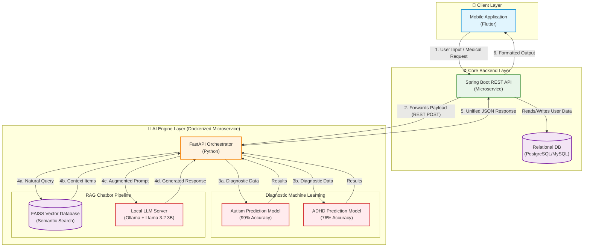

# System Architecture: Medical Diagnostic & Chatbot System

This diagram is designed to showcase your role as a **System Architect** to potential clients on Upwork. It highlights the entire data flow from the mobile app to the backend, and finally to your isolated, containerized AI engine.

## 🏛️ System Architecture Diagram

### 💡 How to use this for Upwork:
1. **Render it:** You can copy the code block above and paste it into [Mermaid Live Editor](https://mermaid.live/), then download it as a high-resolution PNG or SVG!
2. **The Output:** It will generate a beautiful, color-coded diagram showing how the Frontend (Flutter), Backend (Spring Boot), and your AI Microservice (Docker+FastAPI+Ollama+RAG+ML Models) all communicate smoothly.
3. **The impact:** Clients will see you understand microservices, API contracts, local AI deployment, and enterprise architecture.
